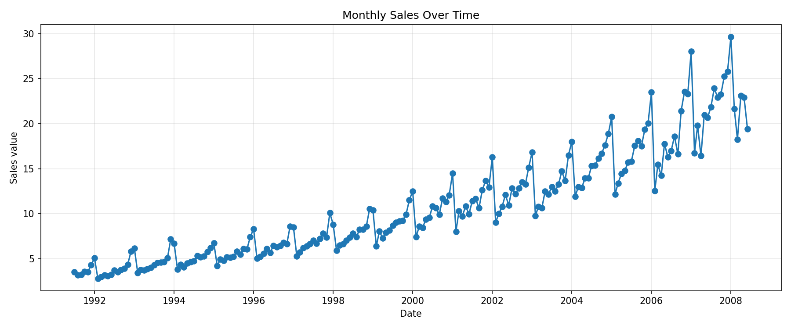
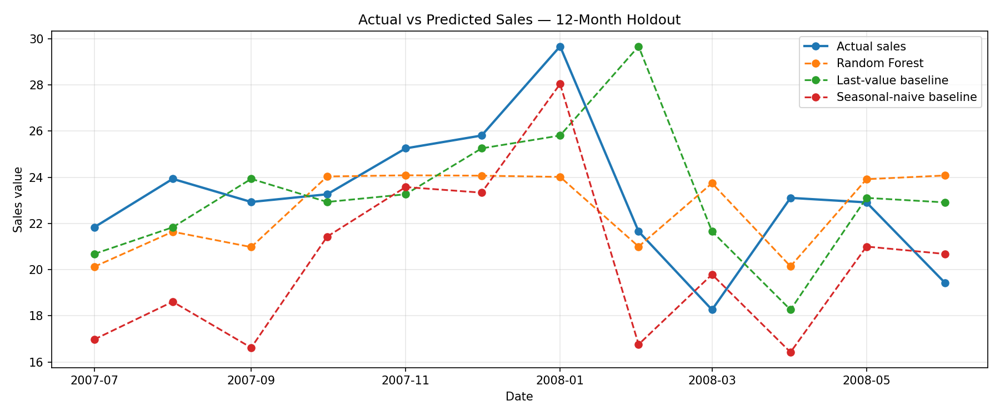

# Sales Forecasting Using Machine Learning

## Project Overview

This project focuses on analyzing historical monthly sales data and forecasting future sales using Machine Learning techniques.

The project compares a Random Forest Regressor with two baseline forecasting methods to evaluate their performance and generate a forecast for the next 12 months.

This project was prepared as part of the CognoRise Infotech Machine Learning Internship.

## Project Objectives

- Analyze historical monthly sales data.
- Clean and prepare the dataset.
- Visualize sales trends over time.
- Create lag features for time-series forecasting.
- Compare different forecasting methods.
- Evaluate models using MAE, RMSE, and R².
- Forecast sales for the next 12 months.
- Save the results, graphs, and model.

## Dataset

The project uses the public monthly sales dataset (`a10.csv`) loaded by the notebook.

The dataset contains date and sales-value information.

**Note:** This is a public example dataset, not private company sales data.

## Technologies Used

- Python
- Pandas
- NumPy
- Matplotlib
- Scikit-learn
- Joblib
- Google Colab
- GitHub

## Forecasting Methods

The project compares three forecasting methods:

1. **Random Forest Regressor:** A machine learning model that predicts sales using previous sales values.
2. **Last-Value Baseline:** Uses the most recently observed sales value as the next prediction.
3. **Seasonal-Naive Baseline:** Uses the sales value from the same period 12 months earlier.

The methods are evaluated on a chronological 12-month holdout period.

The method with the lowest holdout MAE is selected for the future forecast.

## Model Evaluation

The models are evaluated using the following metrics:

- **MAE (Mean Absolute Error):** Measures the average absolute difference between actual and predicted sales. Lower is better.
- **RMSE (Root Mean Squared Error):** Penalizes larger prediction errors more strongly. Lower is better.
- **R² Score:** Measures how well predictions explain variation in actual values. Higher is generally better.

The actual evaluation results are available in the model comparison CSV generated by the notebook.

[View Model Comparison Results](outputs/sales_model_comparison.csv)

## Visualizations

### 1. Historical Sales Trend

This graph shows how the sales values change over time and helps identify patterns in the historical data.

### 2. Actual vs Predicted Sales

This graph compares actual sales with predictions from the Random Forest, last-value baseline, and seasonal-naive baseline over the 12-month evaluation period.

### 3. Forecast for the Next 12 Months

This graph displays recent historical sales and the forecast for the next 12 months.

## Project Files

| File | Description |
|---|---|
| `sales_forecasting_new_project.ipynb` | Main Jupyter notebook |
| `requirements.txt` | Required Python libraries |
| `outputs/sales_cleaned.csv` | Cleaned historical sales data |
| `outputs/sales_model_comparison.csv` | Model evaluation results |
| `outputs/sales_forecast_next_12_months.csv` | Forecast for the next 12 months |
| `outputs/sales_historical_trend.png` | Historical sales graph |
| `outputs/sales_forecast_comparison.png` | Actual vs predicted graph |
| `outputs/sales_forecast_future.png` | Future forecast graph |
| `outputs/sales_forecasting_model.pkl` | Saved model bundle |

## How to Run the Project

1. Open the notebook in Google Colab.
2. Run the notebook cells from top to bottom.
3. Review the historical sales graph and model comparison results.
4. Inspect the 12-month forecast and future forecast graph.
5. Download the generated output files.

## Graphs and Visualizations

### 1. Historical Sales Trend

This graph shows the historical monthly sales values over time. It helps us understand the overall sales pattern and identify changes in sales across different periods.

### 2. Actual vs Predicted Sales

This graph compares actual sales values with predictions generated by the Random Forest model, Last-Value Baseline, and Seasonal-Naive Baseline over the 12-month test period.

It helps us visually compare the predictions of different forecasting methods.

### 3. Forecast for the Next 12 Months

This graph shows the historical sales data together with the forecast for the next 12 months.

The forecast represents estimated future sales based on historical patterns. Actual future sales may differ from these predictions.

---

## Conclusion

In this project, monthly sales data was analyzed to understand historical trends and forecast future sales using Machine Learning.

Three forecasting methods were compared:

1. Random Forest Regressor
2. Last-Value Baseline
3. Seasonal-Naive Baseline

The models were evaluated using Mean Absolute Error (MAE), Root Mean Squared Error (RMSE), and R² score on a chronological 12-month test period.

MAE measures the average absolute prediction error, while RMSE gives more weight to larger errors. Lower MAE and RMSE values generally indicate better predictions. R² measures how well the model explains variations in the actual sales values.

The forecasting method with the lowest MAE on the test period was selected to generate the next 12 months of predictions.

The project demonstrates the importance of data preparation, visualization, model comparison, performance evaluation, and interpreting forecasting results carefully.

## Limitations

- **Limited dataset:** The project uses a public example dataset and may not represent the sales patterns of a real business.
- **Historical data only:** The models primarily use previous sales values and do not consider external factors such as holidays, promotions, price changes, or market conditions.
- **Limited evaluation period:** Performance on a 12-month test period may not represent performance across all future periods.
- **Forecast uncertainty:** Actual future sales may differ from predicted values.
- **Recursive forecasting:** Errors can accumulate when predictions are used to forecast later months. Some methods may produce nearly constant predictions or forecasts that drift over time.
- **Model limitations:** The most accurate method on the test period is not guaranteed to remain the most accurate in the future.

Therefore, the forecasts should be treated as estimates rather than guaranteed future sales.

## Project Outputs

The project generates the following files:

| File | Description |
|---|---|
| `sales_cleaned.csv` | Cleaned historical sales data |
| `sales_model_comparison.csv` | Evaluation metrics for the forecasting methods |
| `sales_forecast_next_12_months.csv` | Predicted sales for the next 12 months |
| `sales_historical_trend.png` | Historical sales visualization |
| `sales_forecast_comparison.png` | Actual vs predicted sales visualization |
| `sales_forecast_future.png` | Future sales forecast visualization |
| `sales_forecasting_model.pkl` | Saved model bundle and evaluation information |

## Final Note

This project demonstrates a basic time-series forecasting workflow using Python and Machine Learning. It provides a starting point for understanding sales trends and comparing forecasting methods. Further improvements could include additional features, more historical data, and testing across multiple time periods.
## Conclusion

In this project, monthly sales data was analyzed and used to forecast future sales using Machine Learning and time-series forecasting techniques.

Three forecasting methods were compared:

1. Random Forest Regressor
2. Last-Value Baseline
3. Seasonal-Naive Baseline

The models were evaluated using Mean Absolute Error (MAE), Root Mean Squared Error (RMSE), and R² score on a chronological 12-month test period.

MAE measures the average absolute prediction error, while RMSE penalizes larger errors more strongly. Lower MAE and RMSE values generally indicate better predictive performance, whereas a higher R² score generally indicates that the model explains more variation in the actual sales values.

Comparing the models helps identify which forecasting method performs best on the test data. The selected method can then be used to generate predictions for the next 12 months.

Overall, this project demonstrates the importance of data cleaning, exploratory data analysis, time-series feature engineering, model evaluation, visualization, and future sales forecasting.

## Limitations

- **Limited dataset:** The project uses a public example dataset that may not represent the sales patterns of a real business.
- **Historical data dependency:** Predictions rely mainly on historical sales patterns and may not capture sudden changes.
- **External factors:** The models do not directly account for promotions, holidays, price changes, economic conditions, or market trends.
- **Limited test period:** Evaluation on a 12-month test period may not represent performance across all future periods.
- **Forecast uncertainty:** Actual future sales may differ from the predicted values.
- **Model limitations:** A model that performs well on historical test data is not guaranteed to remain the most accurate in the future.
- **Long-term predictions:** Forecast errors may accumulate over time, especially when previous predictions are used as inputs for later forecasts.

Therefore, the forecasts should be treated as estimates rather than guaranteed future sales. Further improvements could include additional business-related features, more historical data, and evaluation across multiple test periods.
